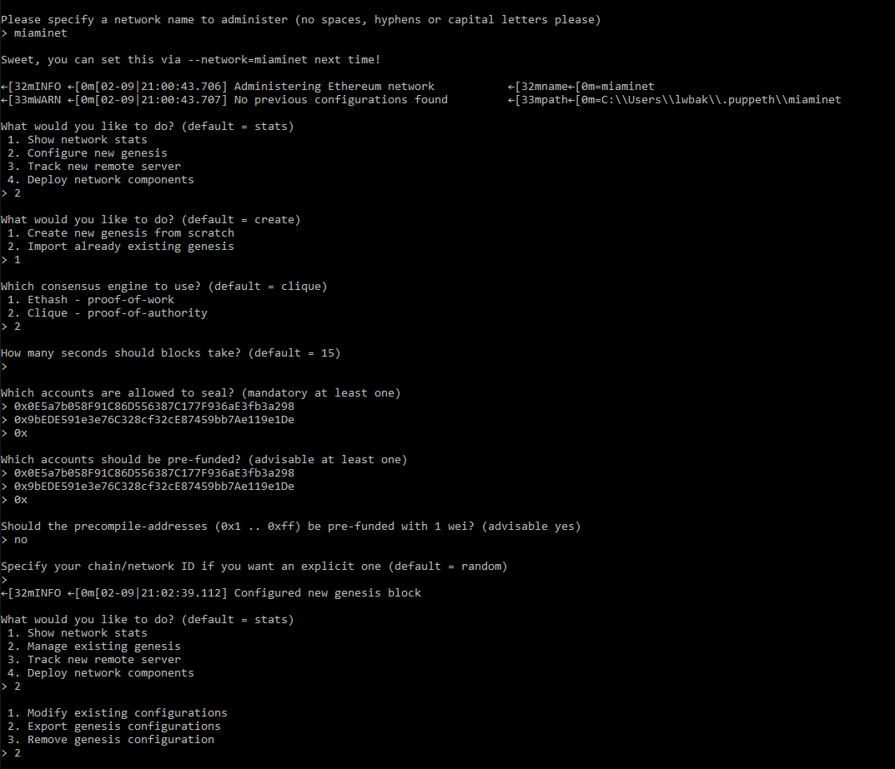
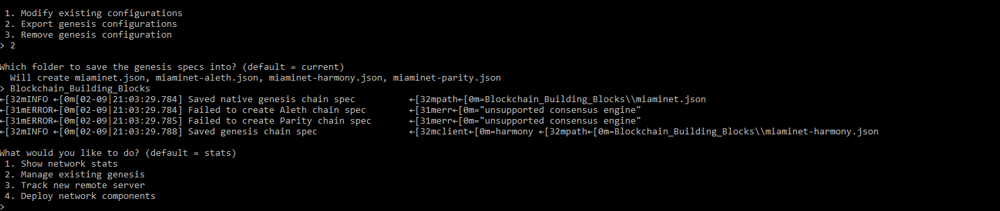
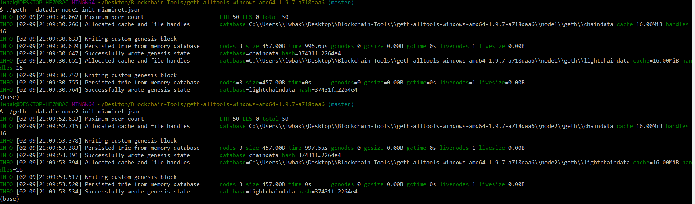
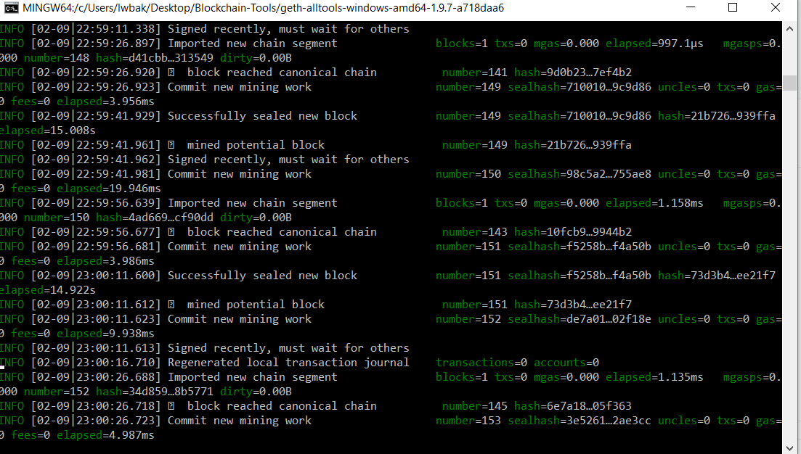
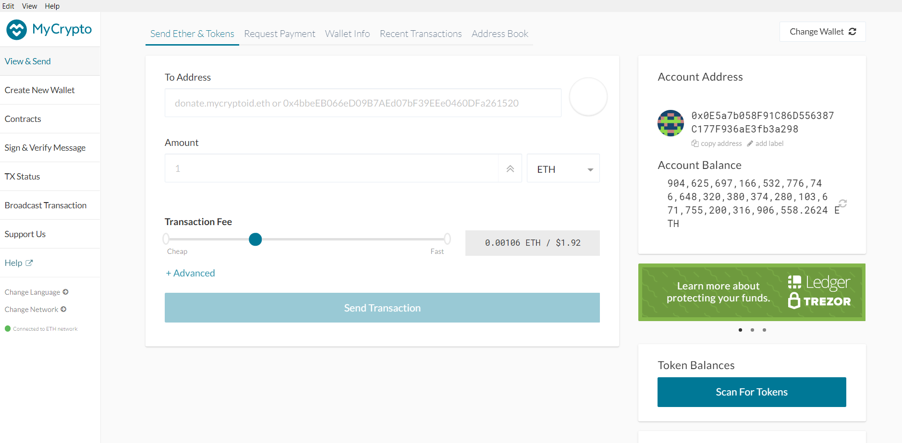
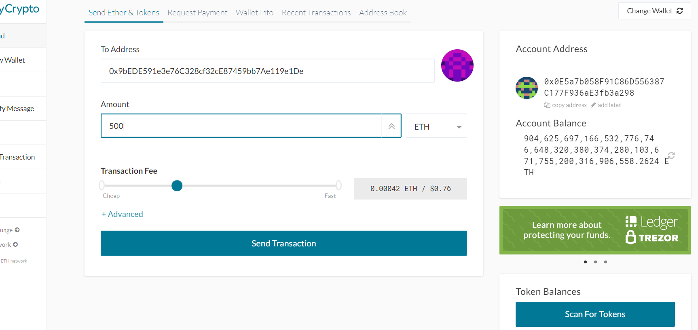
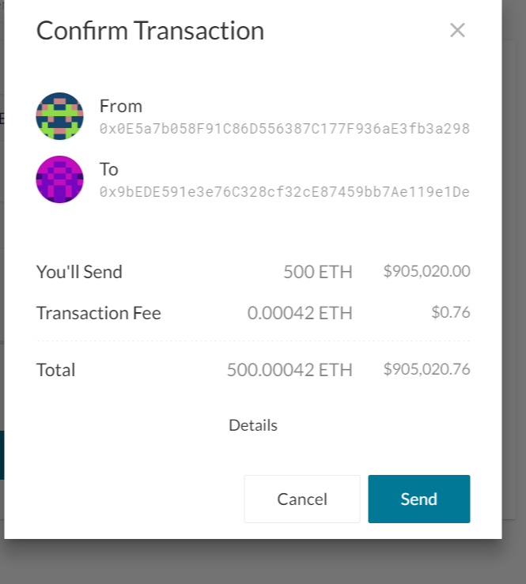

# Blockchain_Building_Blocks

The idea of this project is to create a custom tesnet blockchain that is able to mine fake ETH and show the user how to then send the ETH between wallets. I used Puppeth to generate a genesis block, Geth (command-line tool) to create keys, initialize nodes, and connect nodes together and finally, the Clique Proof of Authority algorithm.

Below you will see the steps taken to set up the Genesis block as well as the nodes that I used to mine the blocks for my test transactions. 

## Custom testnet blockchain setup 

1) set up 2 nodes using geth: 

    ./geth --datadir node1 account new

    ./geth --datadir node2 account new

2) Generate Genesis block using puppeth (I called mine Miaminet) and use the the Clique (Proof of Authority) consensus algorithm. 

3) After creating a new Genesis block I then exported the miaminet.json file.

4) We then initialize the nodes using the json file from the Genesis block: 

    ./geth --datadir node1 init miaminet.json

    ./geth --datadir node2 init miaminet.json

    
5) Next we will use the nodes to mine ETH using the following code (make sure each node is run in a seperate gitbash terminal): 

    ./geth --datadir node1 --unlock "0x0E5a7b058F91C86D556387C177F936aE3fb3a298" --mine --rpc --allow-insecure-unlock

    ./geth --datadir node2 --unlock "0x9bEDE591e3e76C328cf32cE87459bb7Ae119e1De" --mine --port 30304 --bootnodes "enode://4b377f4f2788f1b81aee07aea44e499e5de44114145339009b9725741b35d3fbd50bac7eef42e6c737cfb2104ae1c1403d61c178c09263b8fa9fd7860d8faa42@127.0.0.1:30303" --ipcdisable --allow-insecure-unlock

## Setting up My Crypto to perform transaction

1) The 2 main steps were setting up my Custom Node (Miaminet) and then importing the keystore file from the node1 directory into MyCrypto, which essentially imports my private key.

2) Once inside MyCrypto you can see in the image below that the mining was successful! 

3) The final step in this project was to send ETH between my two nodes, which you can see below: 

